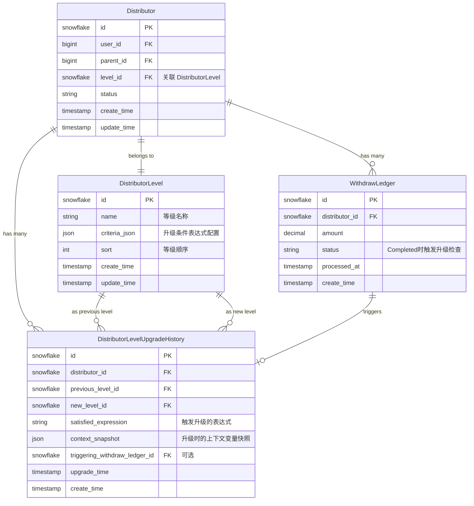

# Phase 1：数据模型设计 - 分销员自动升级

**Feature**: `distributor-auto-upgrade` | **Scope**: `packages/commission-upgrade-bundle` | **日期**: 2025-11-17

## 概述

本文档定义 CommissionUpgradeBundle 的数据模型设计，包括新建实体、复用实体的扩展以及数据库迁移策略。

**核心原则**：
- **最小侵入**：仅在 CommissionUpgradeBundle 创建必要的新实体，复用 OrderCommissionBundle 现有实体
- **向后兼容**：不修改 OrderCommissionBundle 实体结构，通过 criteriaJson 字段扩展配置
- **可追溯性**：所有升级操作记录完整历史，支持审计和回溯

---

## 1. 实体关系图



---

## 2. 新建实体

### 2.1 DistributorLevelUpgradeHistory（升级历史）

**用途**：记录每次分销员等级升级事件的完整信息，支持审计、统计和问题排查。

**实体定义**：

```php
<?php

declare(strict_types=1);

namespace Tourze\CommissionUpgradeBundle\Entity;

use Doctrine\DBAL\Types\Types;
use Doctrine\ORM\Mapping as ORM;
use Tourze\DoctrineSnowflakeBundle\Traits\SnowflakeKeyAware;
use Tourze\DoctrineTimestampBundle\Traits\TimestampableAware;
use Tourze\OrderCommissionBundle\Entity\Distributor;
use Tourze\OrderCommissionBundle\Entity\DistributorLevel;
use Tourze\OrderCommissionBundle\Entity\WithdrawLedger;

#[ORM\Entity]
#[ORM\Table(
    name: 'commission_upgrade_distributor_level_upgrade_history',
    options: ['comment' => '分销员等级升级历史']
)]
#[ORM\Index(name: 'idx_distributor_upgrade_time', columns: ['distributor_id', 'upgrade_time'])]
#[ORM\Index(name: 'idx_upgrade_time', columns: ['upgrade_time'])]
class DistributorLevelUpgradeHistory implements \Stringable
{
    use SnowflakeKeyAware;
    use TimestampableAware;

    /**
     * 所属分销员
     */
    #[ORM\ManyToOne(targetEntity: Distributor::class)]
    #[ORM\JoinColumn(name: 'distributor_id', referencedColumnName: 'id', nullable: false, onDelete: 'CASCADE')]
    private Distributor $distributor;

    /**
     * 原等级（升级前）
     */
    #[ORM\ManyToOne(targetEntity: DistributorLevel::class)]
    #[ORM\JoinColumn(name: 'previous_level_id', referencedColumnName: 'id', nullable: false, onDelete: 'RESTRICT')]
    private DistributorLevel $previousLevel;

    /**
     * 新等级（升级后）
     */
    #[ORM\ManyToOne(targetEntity: DistributorLevel::class)]
    #[ORM\JoinColumn(name: 'new_level_id', referencedColumnName: 'id', nullable: false, onDelete: 'RESTRICT')]
    private DistributorLevel $newLevel;

    /**
     * 满足的条件表达式（触发升级的表达式字符串）
     *
     * 示例："withdrawnAmount > 5000"
     * 示例："withdrawnAmount > 5000 and inviteeCount > 10"
     */
    #[ORM\Column(
        name: 'satisfied_expression',
        type: Types::TEXT,
        nullable: false,
        options: ['comment' => '满足的升级条件表达式']
    )]
    private string $satisfiedExpression;

    /**
     * 升级判断时的上下文变量快照（JSON）
     *
     * 示例：{"withdrawnAmount": 5100, "inviteeCount": 12, "orderCount": 58}
     *
     * @var array<string, mixed>
     */
    #[ORM\Column(
        name: 'context_snapshot',
        type: Types::JSON,
        nullable: false,
        options: ['comment' => '升级判断上下文快照']
    )]
    private array $contextSnapshot = [];

    /**
     * 触发升级的提现流水（可选）
     *
     * 记录是哪笔提现成功后触发的升级检查
     */
    #[ORM\ManyToOne(targetEntity: WithdrawLedger::class)]
    #[ORM\JoinColumn(name: 'triggering_withdraw_ledger_id', referencedColumnName: 'id', nullable: true, onDelete: 'SET NULL')]
    private ?WithdrawLedger $triggeringWithdrawLedger = null;

    /**
     * 升级时间
     */
    #[ORM\Column(
        name: 'upgrade_time',
        type: Types::DATETIME_IMMUTABLE,
        nullable: false,
        options: ['comment' => '升级时间']
    )]
    private \DateTimeImmutable $upgradeTime;

    // ==================== Getters and Setters ====================

    public function getDistributor(): Distributor
    {
        return $this->distributor;
    }

    public function setDistributor(Distributor $distributor): self
    {
        $this->distributor = $distributor;
        return $this;
    }

    public function getPreviousLevel(): DistributorLevel
    {
        return $this->previousLevel;
    }

    public function setPreviousLevel(DistributorLevel $previousLevel): self
    {
        $this->previousLevel = $previousLevel;
        return $this;
    }

    public function getNewLevel(): DistributorLevel
    {
        return $this->newLevel;
    }

    public function setNewLevel(DistributorLevel $newLevel): self
    {
        $this->newLevel = $newLevel;
        return $this;
    }

    public function getSatisfiedExpression(): string
    {
        return $this->satisfiedExpression;
    }

    public function setSatisfiedExpression(string $satisfiedExpression): self
    {
        $this->satisfiedExpression = $satisfiedExpression;
        return $this;
    }

    /**
     * @return array<string, mixed>
     */
    public function getContextSnapshot(): array
    {
        return $this->contextSnapshot;
    }

    /**
     * @param array<string, mixed> $contextSnapshot
     */
    public function setContextSnapshot(array $contextSnapshot): self
    {
        $this->contextSnapshot = $contextSnapshot;
        return $this;
    }

    public function getTriggeringWithdrawLedger(): ?WithdrawLedger
    {
        return $this->triggeringWithdrawLedger;
    }

    public function setTriggeringWithdrawLedger(?WithdrawLedger $triggeringWithdrawLedger): self
    {
        $this->triggeringWithdrawLedger = $triggeringWithdrawLedger;
        return $this;
    }

    public function getUpgradeTime(): \DateTimeImmutable
    {
        return $this->upgradeTime;
    }

    public function setUpgradeTime(\DateTimeImmutable $upgradeTime): self
    {
        $this->upgradeTime = $upgradeTime;
        return $this;
    }

    public function __toString(): string
    {
        return sprintf(
            'DistributorLevelUpgradeHistory{id=%s, distributor=%s, %s→%s, time=%s}',
            $this->id ?? '0',
            $this->distributor->getId() ?? 'null',
            $this->previousLevel->getName(),
            $this->newLevel->getName(),
            $this->upgradeTime->format('Y-m-d H:i:s')
        );
    }
}
```

**字段说明**：

| 字段 | 类型 | 说明 | 索引 |
|------|------|------|------|
| `id` | snowflake | 主键（雪花ID） | PRIMARY |
| `distributor_id` | snowflake | 关联分销员 | idx_distributor_upgrade_time |
| `previous_level_id` | snowflake | 升级前等级 | - |
| `new_level_id` | snowflake | 升级后等级 | - |
| `satisfied_expression` | TEXT | 触发升级的表达式 | - |
| `context_snapshot` | JSON | 上下文变量快照 | - |
| `triggering_withdraw_ledger_id` | snowflake (nullable) | 触发的提现流水 | - |
| `upgrade_time` | timestamp | 升级时间 | idx_upgrade_time |
| `create_time` | timestamp | 创建时间（自动填充） | - |
| `update_time` | timestamp | 更新时间（自动填充） | - |

**索引策略**：
- `idx_distributor_upgrade_time`：支持查询某分销员的升级历史（按时间排序）
- `idx_upgrade_time`：支持按时间范围统计升级事件（运营报表）

**删除策略**：
- `distributor_id`：CASCADE（分销员删除时同步删除升级历史）
- `previous_level_id` / `new_level_id`：RESTRICT（防止删除正在使用的等级）
- `triggering_withdraw_ledger_id`：SET NULL（提现记录删除时保留升级历史）

---

## 3. 复用实体扩展

### 3.1 DistributorLevel.criteriaJson 结构

**现状**：`DistributorLevel` 实体已有 `criteriaJson` 字段（JSON 类型），当前未使用。

**扩展设计**：使用 `criteriaJson` 存储升级条件表达式配置。

#### 3.1.1 JSON 结构定义

```json
{
  "upgradeExpression": "withdrawnAmount > 5000"
}
```

**复杂条件示例**：

```json
{
  "upgradeExpression": "withdrawnAmount > 5000 and inviteeCount > 10"
}
```

**OR 条件示例**：

```json
{
  "upgradeExpression": "withdrawnAmount > 10000 or (inviteeCount > 20 and orderCount > 100)"
}
```

#### 3.1.2 Schema 约束

| 字段 | 类型 | 必填 | 说明 |
|------|------|------|------|
| `upgradeExpression` | string | 是 | 升级条件表达式（Symfony Expression Language 语法） |

#### 3.1.3 可用变量清单

表达式中可引用的变量（由 `UpgradeContextProvider` 提供）：

| 变量名 | 类型 | 说明 | 示例值 |
|--------|------|------|--------|
| `withdrawnAmount` | float | 已提现佣金总额（仅统计 Completed 状态） | 5100.50 |
| `inviteeCount` | int | 邀请人数（一级下线数量） | 12 |
| `orderCount` | int | 订单数（关联该分销员的订单总数） | 58 |
| `activeInviteeCount` | int | 活跃邀请人数（30天内有订单的下线） | 8 |

**扩展性**：未来可新增变量（如 `teamPerformance`、`repeatPurchaseRate`），需同步更新 `UpgradeContextProvider` 和验证逻辑。

#### 3.1.4 验证规则

**保存前验证**（在 EasyAdmin 表单提交时执行）：

1. **语法验证**：使用 `Symfony\Component\ExpressionLanguage\ExpressionLanguage::parse()` 验证语法正确性
2. **变量白名单验证**：检查表达式中引用的变量是否在允许清单内
3. **类型检查**：确保返回值为布尔类型（升级条件必须是真/假判断）

**示例验证代码**：

```php
public function validateCriteriaJson(array $criteriaJson): void
{
    if (!isset($criteriaJson['upgradeExpression'])) {
        throw new \InvalidArgumentException('缺少 upgradeExpression 字段');
    }

    $expression = $criteriaJson['upgradeExpression'];
    $evaluator = new UpgradeExpressionEvaluator();
    $evaluator->validate($expression); // 抛出异常如果验证失败
}
```

### 3.2 DistributorLevel 实体补充说明

**不需要修改实体代码**，仅通过 `criteriaJson` 字段存储配置。

**示例数据**：

```sql
-- 1级→2级：提现金额达到5000元
UPDATE order_commission_distributor_level
SET criteria_json = '{"upgradeExpression": "withdrawnAmount >= 5000"}'
WHERE id = 2;

-- 2级→3级：提现金额达到10000元 且 邀请人数>=10
UPDATE order_commission_distributor_level
SET criteria_json = '{"upgradeExpression": "withdrawnAmount >= 10000 and inviteeCount >= 10"}'
WHERE id = 3;
```

---

## 4. 数据完整性约束

### 4.1 外键约束

| 外键 | 约束行为 | 理由 |
|------|---------|------|
| `distributor_id` | CASCADE | 分销员删除时同步删除升级历史（符合数据生命周期） |
| `previous_level_id` | RESTRICT | 防止删除正在使用的等级（历史数据依赖） |
| `new_level_id` | RESTRICT | 防止删除正在使用的等级（历史数据依赖） |
| `triggering_withdraw_ledger_id` | SET NULL | 提现记录删除时保留升级历史（历史可追溯） |

### 4.2 应用层约束

1. **升级幂等性**：同一分销员同一时刻只能执行一次升级（通过乐观锁保障）
2. **等级顺序性**：升级必须逐级进行，禁止跳级（在 `DistributorUpgradeService` 中验证）
3. **条件表达式非空**：DistributorLevel 保存时必须填写 `upgradeExpression`（后台表单验证）

---

## 5. 性能考量

### 5.1 查询优化

**高频查询场景**：

1. **查询分销员升级历史**（分销员个人中心）
   ```sql
   SELECT * FROM commission_upgrade_distributor_level_upgrade_history
   WHERE distributor_id = ?
   ORDER BY upgrade_time DESC;
   ```
   **优化**：使用复合索引 `idx_distributor_upgrade_time`

2. **统计某时间段内的升级事件**（运营报表）
   ```sql
   SELECT COUNT(*) FROM commission_upgrade_distributor_level_upgrade_history
   WHERE upgrade_time BETWEEN ? AND ?;
   ```
   **优化**：使用索引 `idx_upgrade_time`

3. **计算已提现佣金总额**（升级条件评估）
   ```sql
   SELECT SUM(amount) FROM order_commission_withdraw_ledger
   WHERE distributor_id = ? AND status = 'Completed';
   ```
   **优化**：
   - 在 `WithdrawLedger` 表添加复合索引 `idx_distributor_status (distributor_id, status)`
   - 考虑引入缓存层（Redis）存储已提现金额，提现成功时更新

### 5.2 写入性能

**高并发场景**：1000名分销员同时提现成功触发升级检查。

**优化策略**：
1. **异步执行**：使用 Symfony Messenger 将升级检查任务放入队列
2. **批量查询**：避免 N+1 查询，使用 Doctrine QueryBuilder 批量加载关联数据
3. **乐观锁**：使用 Doctrine 乐观锁机制避免并发冲突

---

## 6. 数据归档策略

**问题**：随着时间推移，升级历史表数据量持续增长，可能影响查询性能。

**归档方案**（后续优化）：

1. **时间分区**：按年份或季度分区存储历史数据
   ```sql
   ALTER TABLE commission_upgrade_distributor_level_upgrade_history
   PARTITION BY RANGE (YEAR(upgrade_time)) (
       PARTITION p2025 VALUES LESS THAN (2026),
       PARTITION p2026 VALUES LESS THAN (2027),
       ...
   );
   ```

2. **冷数据归档**：将1年前的历史数据迁移到归档表或对象存储
   ```sql
   CREATE TABLE commission_upgrade_distributor_level_upgrade_history_archive
   LIKE commission_upgrade_distributor_level_upgrade_history;

   INSERT INTO ...archive SELECT * FROM ...history WHERE upgrade_time < DATE_SUB(NOW(), INTERVAL 1 YEAR);
   DELETE FROM ...history WHERE upgrade_time < DATE_SUB(NOW(), INTERVAL 1 YEAR);
   ```

**决策**：Phase 1 不实现归档，待数据量达到100万条后评估。

---

## 7. 测试数据准备

### 7.1 Fixture 设计

**测试场景覆盖**：

1. **分销员等级配置**：
   - 1级（默认等级）：无升级条件
   - 2级：`"withdrawnAmount >= 5000"`
   - 3级：`"withdrawnAmount >= 10000 and inviteeCount >= 10"`

2. **测试分销员**：
   - 分销员A：已提现4500元，9个下线（接近2级阈值）
   - 分销员B：已提现5200元，5个下线（满足2级，不满足3级）
   - 分销员C：已提现12000元，15个下线（满足3级）

3. **提现流水**：
   - 模拟 Completed、Failed、Pending 等不同状态

**Fixture 文件示例**：

```yaml
# fixtures/distributor_levels.yaml
Tourze\OrderCommissionBundle\Entity\DistributorLevel:
  level_1:
    name: '一级分销员'
    sort: 1
    isDefault: true
    criteriaJson: {}
  level_2:
    name: '二级分销员'
    sort: 2
    criteriaJson: { "upgradeExpression": "withdrawnAmount >= 5000" }
  level_3:
    name: '三级分销员'
    sort: 3
    criteriaJson: { "upgradeExpression": "withdrawnAmount >= 10000 and inviteeCount >= 10" }
```

---

## 8. 安全与隐私

### 8.1 敏感数据处理

**context_snapshot 字段**：存储升级判断时的上下文变量，可能包含业务敏感信息。

**保护措施**：
1. **最小化记录**：仅记录必要的统计指标（如金额、人数），不记录个人身份信息
2. **访问控制**：升级历史仅管理员和分销员本人可查看
3. **日志脱敏**：记录日志时对金额字段进行脱敏（如 `5100.50` → `5***.**`）

### 8.2 GDPR 合规

**问题**：用户请求删除账号时，是否需要删除升级历史？

**决策**：
- **CASCADE 删除**：分销员账号删除时同步删除升级历史（通过外键约束实现）
- **匿名化处理**：如需保留统计数据，可将 `distributor_id` 替换为匿名标识

---

## 9. 下一步行动

- [ ] 创建 `DistributorLevelUpgradeHistory` 实体文件
- [ ] 创建 Fixture 文件用于集成测试
- [ ] 实现 Repository 扩展方法（如 `sumCompletedAmount`）
- [ ] 编写单元测试验证实体约束
- [ ] 生成 Phase 1 服务契约文档（contracts/*.md）

---

**文档完成日期**：2025-11-17
**审核状态**：待审核
**下一阶段**：Phase 1 - 服务契约设计
